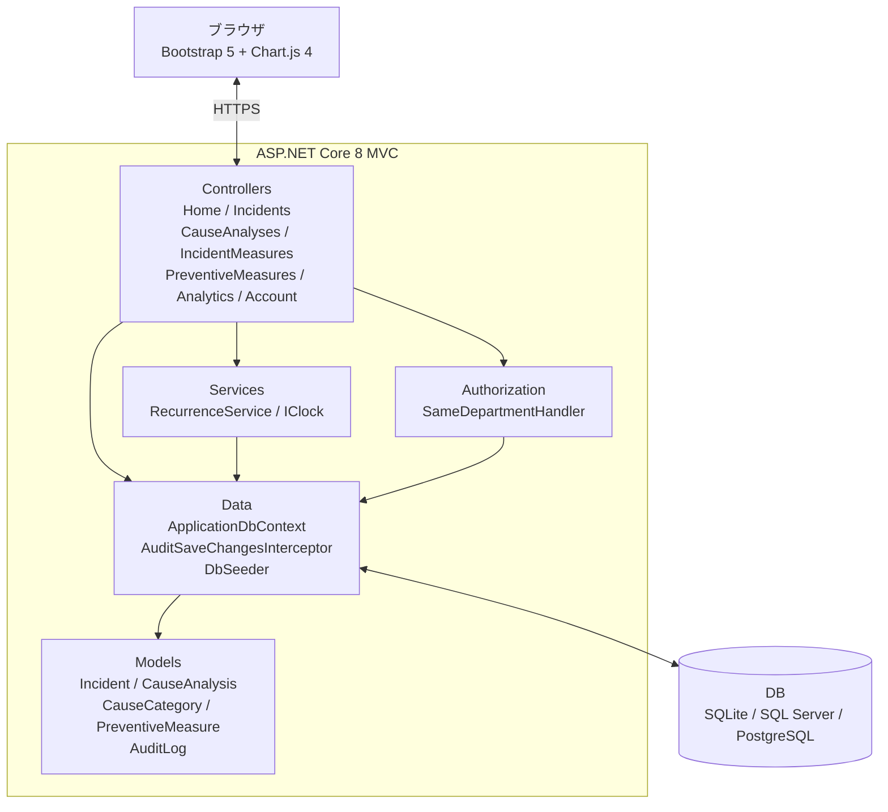
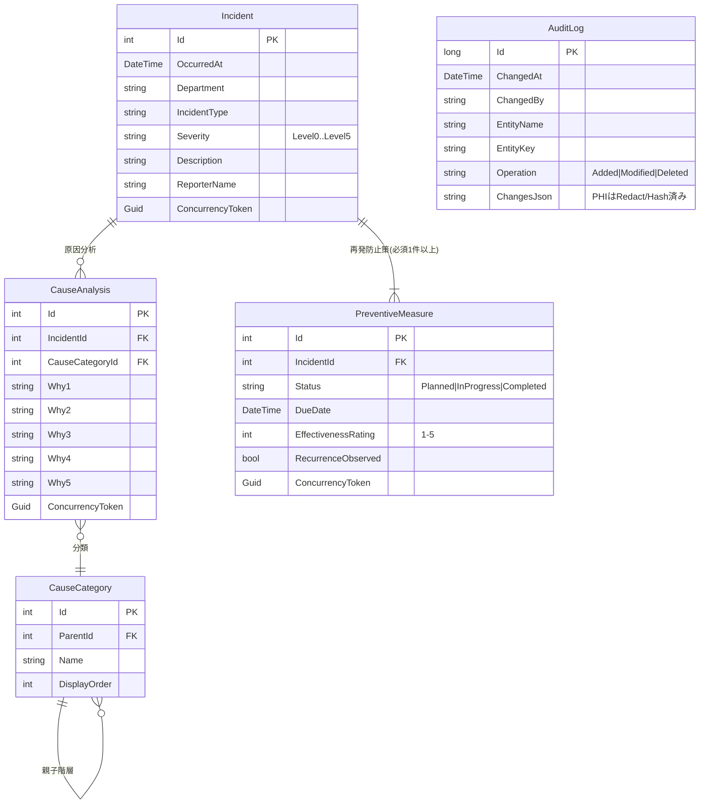
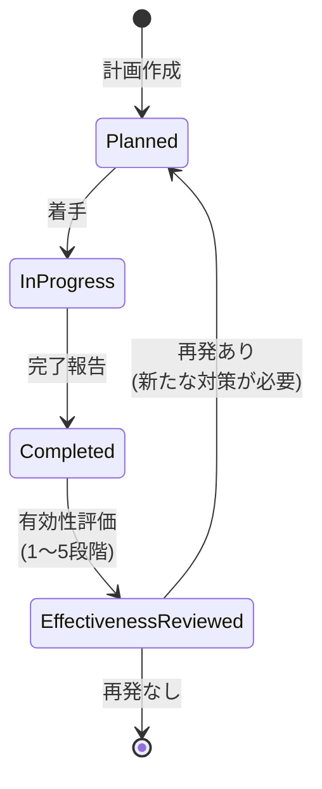

## Architecture

IncidentInsight は **ASP.NET Core 8 MVC + EF Core** で構築された、医療インシデント管理システムです。

### 構成要素（ディレクトリ）

- `src/IncidentInsight.Web/Controllers/`: UI の入口（画面遷移、入力受付）
- `src/IncidentInsight.Web/Models/`: ドメインモデル（Incident / CauseAnalysis / PreventiveMeasure など）
- `src/IncidentInsight.Web/Data/`: `ApplicationDbContext` とシード/監査インターセプタ
- `src/IncidentInsight.Web/Services/`: 再発検出などのドメインサービス
- `src/IncidentInsight.Web/Authorization/`: 部署スコープなどの認可

### コンポーネント関係

### データモデル（ER図）

`Incident` を中心に、`CauseAnalysis` と `PreventiveMeasure` がぶら下がり、`AuditLog` が変更を自動記録します。`CauseCategory` は親子階層を持つ自己参照テーブルです。

### 再発防止策のライフサイクル

`PreventiveMeasure.Status` は `Planned → InProgress → Completed` を経て、有効性評価で再発が確認された場合は新たな対策計画に戻ります。`DueDate < 今日 かつ Status != Completed` のときは `IsOverdue` 計算プロパティが立ち、UI で警告表示されます。

### 主要な設計ポイント

- **3ステップ登録フロー**: 基本情報 → なぜなぜ分析 → 再発防止策、の順で入力を段階化。
- **再発検出**: 同部署・同種別・同原因分類の複数発生を検知して警告。
- **監査ログ**: 更新の追跡を `AuditSaveChangesInterceptor` で一元化。

