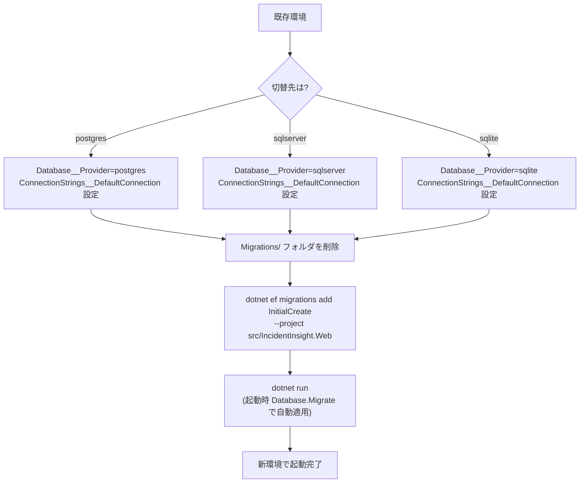

## Migration FAQ（DB切替・マイグレーション事故を避ける）

### 切替手順の全体像

> ⚠️ 既に本番に適用済みのマイグレーションを消すと危険です。原則「新規環境に新規マイグレーション」を選択し、既存DBの移行が必要な場合は別途データ移行計画を立ててください。

### Q. sqlite から postgres / sqlserver に切り替えたい。何をすればいい？

1. `Database__Provider` と `ConnectionStrings__DefaultConnection` を切り替える
2. **対象プロバイダ向けにマイグレーションを作り直す**

> ⚠️ EF Core のマイグレーションはプロバイダ依存です。SQLite 用のマイグレーションをそのまま適用しないでください。

### Q. 既存の `Migrations/` を消すのが怖い

- 本番DBにすでに適用されているマイグレーションを消すと危険です。
- 切替時は「新規環境に新規マイグレーション」が安全です（既存DBへ適用する移行計画は別途必要）。

### Q. どの環境変数が必要？

- `Database__Provider`: `sqlite` / `postgres` / `sqlserver`
- `ConnectionStrings__DefaultConnection`: 接続文字列

